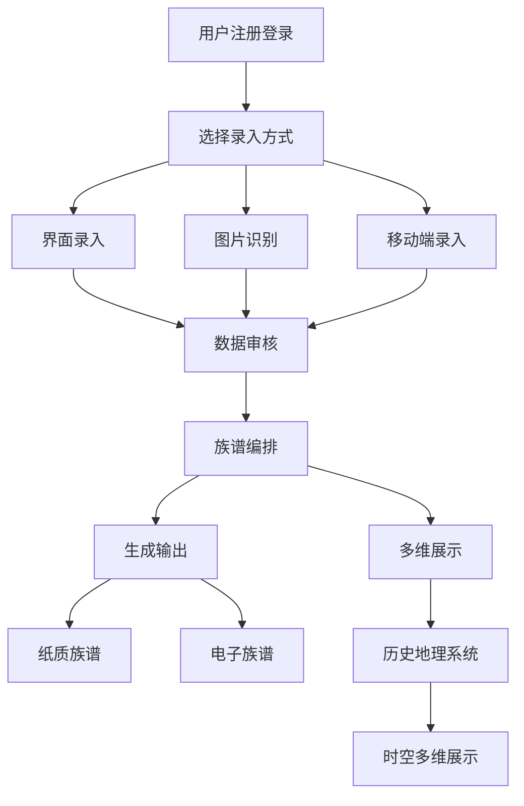

# 族谱编排系统产品需求文档

## 1. 产品概述

族谱编排系统是一个集数据录入、智能识别、编排生成、多维展示于一体的综合性族谱管理平台。系统支持多种数据来源，能够生成传统纸质族谱和现代电子族谱，并提供基于时空维度的历史地理信息展示功能。

- 解决传统族谱编排效率低、数据分散、展示单一的问题
- 服务于家族组织、文史研究机构、个人用户
- 打造集族谱编排、历史研究、文化传承于一体的数字化平台

## 2. 核心功能

### 2.1 用户角色

| 角色 | 注册方式 | 核心权限 |
|------|----------|----------|
| 普通用户 | 手机号/邮箱注册 | 查看公开族谱、录入个人信息、申请加入族谱 |
| 族谱管理员 | 邀请码升级 | 创建编辑族谱、审核用户申请、生成族谱书籍 |
| 系统管理员 | 内部分配 | 用户管理、数据审核、系统配置 |
| 研究学者 | 认证申请 | 访问历史数据库、导出研究数据、批量分析 |

### 2.2 功能模块

本系统包含以下核心页面：
1. **数据录入管理页面**：界面录入、图片识别录入、移动端同步管理
2. **族谱编排页面**：族谱结构设计、人物关系编辑、版式布局设置
3. **生成导出页面**：纸质族谱生成、电子书制作、印刷文件输出
4. **多维展示页面**：族谱树状图、关系网络图、统计分析图表
5. **历史地理信息页面**：时间轴展示、地图标注、人物迁徙路径
6. **用户管理页面**：权限分配、审核流程、消息通知

### 2.3 页面详情

| 页面名称 | 模块名称 | 功能描述 |
|----------|----------|----------|
| 数据录入管理页面 | 界面录入模块 | 提供表单化录入界面，支持人物基本信息、关系信息、生平事迹等结构化录入 |
| 数据录入管理页面 | 图片识别模块 | 集成OCR技术，自动识别族谱图片中的文字信息，智能解析人物关系和基本信息 |
| 数据录入管理页面 | 移动端同步模块 | 提供移动端APP，支持用户随时录入个人信息，自动匹配挂接到对应族谱 |
| 族谱编排页面 | 结构设计模块 | 提供拖拽式族谱结构编辑器，支持多种族谱样式和布局模板 |
| 族谱编排页面 | 关系编辑模块 | 可视化编辑人物关系，支持复杂家族关系的准确表达 |
| 族谱编排页面 | 版式设置模块 | 提供丰富的版式模板，支持字体、颜色、排版的个性化定制 |
| 生成导出页面 | 纸质生成模块 | 生成符合印刷标准的PDF文件，支持多种纸张规格和装订方式 |
| 生成导出页面 | 电子书制作模块 | 生成交互式电子族谱，支持搜索、链接跳转、多媒体展示 |
| 生成导出页面 | 数据导出模块 | 支持多种格式数据导出，便于数据备份和第三方系统集成 |
| 多维展示页面 | 族谱树图模块 | 以树状结构展示家族关系，支持多代展示和局部放大 |
| 多维展示页面 | 关系网络模块 | 以网络图形式展示复杂的人际关系，支持关系强度和类型可视化 |
| 多维展示页面 | 统计分析模块 | 提供人口统计、地域分布、职业分析等多维度数据分析 |
| 历史地理信息页面 | 时间轴模块 | 按时间顺序展示历史事件、人物生平、家族大事记 |
| 历史地理信息页面 | 地图标注模块 | 在地图上标注重要地点、人物故居、家族迁徙路径 |
| 历史地理信息页面 | 历史整合模块 | 整合正史、地方志、族谱数据，提供跨数据源的历史信息检索 |
| 用户管理页面 | 权限管理模块 | 分级权限控制，支持细粒度的功能和数据访问权限设置 |
| 用户管理页面 | 审核流程模块 | 用户申请、数据修改、内容发布的多级审核机制 |
| 用户管理页面 | 协作管理模块 | 支持多用户协作编辑，提供版本控制和冲突解决机制 |

## 3. 核心流程

### 3.1 数据录入流程

**界面录入流程**：用户登录 → 选择族谱 → 添加人物信息 → 设置关系链接 → 保存提交 → 管理员审核

**图片识别流程**：上传族谱图片 → OCR文字识别 → 智能信息解析 → 用户确认修正 → 自动关系匹配 → 数据入库

**移动端录入流程**：移动端注册 → 填写个人信息 → 申请加入族谱 → 管理员审核 → 自动挂接族谱

### 3.2 族谱生成流程

**编排设计流程**：选择模板 → 设计族谱结构 → 编辑人物信息 → 设置版式样式 → 预览调整 → 生成文件

**印刷输出流程**：完成编排 → 生成印刷PDF → 质量检查 → 提交印刷厂 → 跟踪印刷进度

### 3.3 历史地理信息整合流程

**数据整合流程**：收集历史资料 → 数据清洗标准化 → 时空信息提取 → 地理位置标注 → 关联族谱数据 → 多维展示

## 4. 用户界面设计

### 4.1 设计风格

- **主色调**：深蓝色(#1B365D)、金色(#D4AF37)，体现传统文化底蕴
- **辅助色**：浅灰色(#F5F5F5)、深灰色(#666666)
- **按钮样式**：圆角矩形，渐变效果，悬停状态变化
- **字体**：中文使用思源黑体，英文使用Roboto，标题18px，正文14px
- **布局风格**：卡片式设计，左侧导航，响应式布局
- **图标风格**：线性图标，统一风格，支持主题色变化

### 4.2 页面设计概览

| 页面名称 | 模块名称 | UI元素 |
|----------|----------|--------|
| 数据录入管理页面 | 界面录入模块 | 多步骤表单，进度指示器，字段验证提示，关系选择器组件 |
| 数据录入管理页面 | 图片识别模块 | 图片上传区域，识别进度条，结果预览面板，编辑确认界面 |
| 族谱编排页面 | 结构设计模块 | 拖拽式编辑器，工具栏，属性面板，预览窗口，模板库 |
| 多维展示页面 | 族谱树图模块 | 可缩放树状图，节点详情弹窗，搜索过滤器，导出按钮 |
| 历史地理信息页面 | 地图标注模块 | 交互式地图，时间滑块，图层控制，信息标注点，路径动画 |

### 4.3 响应式设计

系统采用桌面优先的响应式设计，支持PC端、平板端、移动端的自适应显示。移动端优化触摸操作，提供手势支持和简化界面。

## 5. 技术特性

### 5.1 核心技术要求

- **OCR识别**：集成百度OCR或腾讯OCR API，支持古籍文字识别
- **图像处理**：支持图片预处理、去噪、倾斜校正
- **数据挖掘**：智能关系推断、重复数据检测、信息补全
- **地图服务**：集成高德地图或百度地图API
- **文件生成**：PDF生成、电子书制作、印刷文件输出
- **移动端**：React Native或Flutter跨平台开发

### 5.2 性能要求

- **响应时间**：页面加载时间<3秒，数据查询响应<1秒
- **并发支持**：支持1000+用户同时在线
- **数据容量**：支持百万级人物数据存储
- **文件处理**：支持大型族谱图片(50MB+)的快速识别

### 5.3 安全要求

- **数据加密**：敏感数据AES-256加密存储
- **访问控制**：基于角色的权限管理(RBAC)
- **数据备份**：自动备份机制，支持数据恢复
- **隐私保护**：个人信息脱敏处理，符合数据保护法规