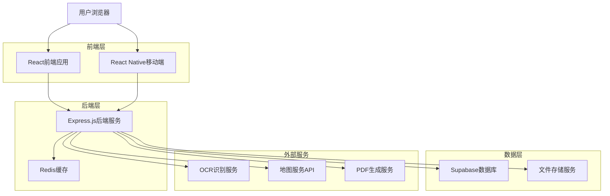
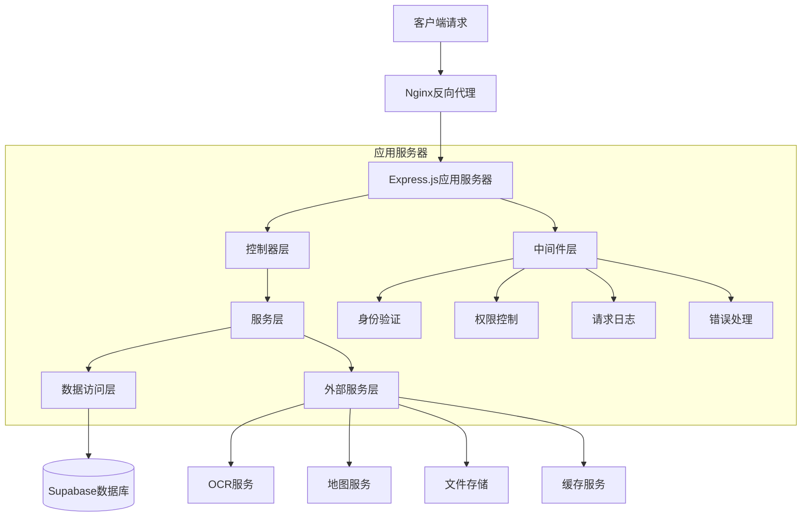
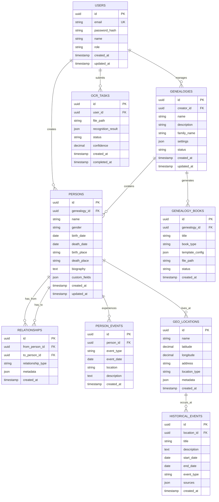

# 族谱编排系统技术架构文档

## 1. 架构设计



## 2. 技术描述

- **前端Web**: React@18 + TypeScript + Ant Design + Vite
- **移动端**: React Native@0.72 + TypeScript
- **后端**: Express@4 + TypeScript + Node.js@18
- **数据库**: Supabase (PostgreSQL)
- **缓存**: Redis@7
- **文件存储**: Supabase Storage
- **OCR服务**: 百度OCR API / 腾讯OCR API
- **地图服务**: 高德地图API
- **PDF生成**: Puppeteer + jsPDF

## 3. 路由定义

| 路由 | 用途 |
|------|------|
| / | 首页，展示系统介绍和功能概览 |
| /login | 登录页面，用户身份验证 |
| /register | 注册页面，新用户注册 |
| /dashboard | 用户仪表板，个人数据概览 |
| /genealogy/list | 族谱列表页面，显示用户可访问的族谱 |
| /genealogy/:id | 族谱详情页面，展示具体族谱信息 |
| /genealogy/:id/edit | 族谱编辑页面，编辑族谱结构和内容 |
| /person/:id | 人物详情页面，显示个人信息和关系 |
| /input/manual | 手动录入页面，表单化数据录入 |
| /input/ocr | 图片识别页面，OCR识别和数据确认 |
| /generate/book | 族谱生成页面，生成纸质和电子族谱 |
| /visualization | 多维展示页面，族谱可视化分析 |
| /history-geo | 历史地理信息页面，时空数据展示 |
| /admin/users | 用户管理页面，管理员功能 |
| /admin/audit | 审核管理页面，内容审核流程 |

## 4. API定义

### 4.1 核心API

**用户认证相关**
```
POST /api/auth/login
```

请求参数:
| 参数名 | 参数类型 | 是否必需 | 描述 |
|--------|----------|----------|------|
| email | string | true | 用户邮箱 |
| password | string | true | 用户密码 |

响应参数:
| 参数名 | 参数类型 | 描述 |
|--------|----------|------|
| success | boolean | 登录是否成功 |
| token | string | JWT访问令牌 |
| user | object | 用户基本信息 |

**族谱管理相关**
```
GET /api/genealogy/:id
POST /api/genealogy
PUT /api/genealogy/:id
DELETE /api/genealogy/:id
```

**人物信息相关**
```
GET /api/person/:id
POST /api/person
PUT /api/person/:id
DELETE /api/person/:id
```

**OCR识别相关**
```
POST /api/ocr/recognize
```

请求参数:
| 参数名 | 参数类型 | 是否必需 | 描述 |
|--------|----------|----------|------|
| image | file | true | 上传的图片文件 |
| type | string | false | 识别类型(genealogy/document) |

响应参数:
| 参数名 | 参数类型 | 描述 |
|--------|----------|------|
| success | boolean | 识别是否成功 |
| data | object | 识别结果数据 |
| confidence | number | 识别置信度 |

**文件生成相关**
```
POST /api/generate/pdf
POST /api/generate/ebook
```

**地理信息相关**
```
GET /api/geo/locations
POST /api/geo/migration
```

## 5. 服务器架构图



## 6. 数据模型

### 6.1 数据模型定义



### 6.2 数据定义语言

**用户表 (users)**
```sql
-- 创建用户表
CREATE TABLE users (
    id UUID PRIMARY KEY DEFAULT gen_random_uuid(),
    email VARCHAR(255) UNIQUE NOT NULL,
    password_hash VARCHAR(255) NOT NULL,
    name VARCHAR(100) NOT NULL,
    role VARCHAR(20) DEFAULT 'user' CHECK (role IN ('user', 'admin', 'genealogy_admin', 'researcher')),
    avatar_url TEXT,
    phone VARCHAR(20),
    created_at TIMESTAMP WITH TIME ZONE DEFAULT NOW(),
    updated_at TIMESTAMP WITH TIME ZONE DEFAULT NOW()
);

-- 创建索引
CREATE INDEX idx_users_email ON users(email);
CREATE INDEX idx_users_role ON users(role);

-- 权限设置
GRANT SELECT ON users TO anon;
GRANT ALL PRIVILEGES ON users TO authenticated;
```

**族谱表 (genealogies)**
```sql
-- 创建族谱表
CREATE TABLE genealogies (
    id UUID PRIMARY KEY DEFAULT gen_random_uuid(),
    creator_id UUID REFERENCES users(id) ON DELETE CASCADE,
    name VARCHAR(200) NOT NULL,
    description TEXT,
    family_name VARCHAR(100) NOT NULL,
    settings JSONB DEFAULT '{}',
    status VARCHAR(20) DEFAULT 'draft' CHECK (status IN ('draft', 'published', 'archived')),
    is_public BOOLEAN DEFAULT false,
    created_at TIMESTAMP WITH TIME ZONE DEFAULT NOW(),
    updated_at TIMESTAMP WITH TIME ZONE DEFAULT NOW()
);

-- 创建索引
CREATE INDEX idx_genealogies_creator ON genealogies(creator_id);
CREATE INDEX idx_genealogies_family_name ON genealogies(family_name);
CREATE INDEX idx_genealogies_status ON genealogies(status);

-- 权限设置
GRANT SELECT ON genealogies TO anon;
GRANT ALL PRIVILEGES ON genealogies TO authenticated;
```

**人物表 (persons)**
```sql
-- 创建人物表
CREATE TABLE persons (
    id UUID PRIMARY KEY DEFAULT gen_random_uuid(),
    genealogy_id UUID REFERENCES genealogies(id) ON DELETE CASCADE,
    name VARCHAR(100) NOT NULL,
    gender VARCHAR(10) CHECK (gender IN ('male', 'female', 'unknown')),
    birth_date DATE,
    death_date DATE,
    birth_place VARCHAR(200),
    death_place VARCHAR(200),
    biography TEXT,
    occupation VARCHAR(100),
    education VARCHAR(200),
    custom_fields JSONB DEFAULT '{}',
    photo_url TEXT,
    generation INTEGER,
    created_at TIMESTAMP WITH TIME ZONE DEFAULT NOW(),
    updated_at TIMESTAMP WITH TIME ZONE DEFAULT NOW()
);

-- 创建索引
CREATE INDEX idx_persons_genealogy ON persons(genealogy_id);
CREATE INDEX idx_persons_name ON persons(name);
CREATE INDEX idx_persons_generation ON persons(generation);
CREATE INDEX idx_persons_birth_date ON persons(birth_date);

-- 权限设置
GRANT SELECT ON persons TO anon;
GRANT ALL PRIVILEGES ON persons TO authenticated;
```

**关系表 (relationships)**
```sql
-- 创建关系表
CREATE TABLE relationships (
    id UUID PRIMARY KEY DEFAULT gen_random_uuid(),
    from_person_id UUID REFERENCES persons(id) ON DELETE CASCADE,
    to_person_id UUID REFERENCES persons(id) ON DELETE CASCADE,
    relationship_type VARCHAR(50) NOT NULL CHECK (relationship_type IN (
        'father', 'mother', 'son', 'daughter', 'spouse', 'brother', 'sister',
        'grandfather', 'grandmother', 'grandson', 'granddaughter', 'uncle', 'aunt',
        'nephew', 'niece', 'cousin', 'other'
    )),
    metadata JSONB DEFAULT '{}',
    created_at TIMESTAMP WITH TIME ZONE DEFAULT NOW(),
    UNIQUE(from_person_id, to_person_id, relationship_type)
);

-- 创建索引
CREATE INDEX idx_relationships_from ON relationships(from_person_id);
CREATE INDEX idx_relationships_to ON relationships(to_person_id);
CREATE INDEX idx_relationships_type ON relationships(relationship_type);

-- 权限设置
GRANT SELECT ON relationships TO anon;
GRANT ALL PRIVILEGES ON relationships TO authenticated;
```

**地理位置表 (geo_locations)**
```sql
-- 创建地理位置表
CREATE TABLE geo_locations (
    id UUID PRIMARY KEY DEFAULT gen_random_uuid(),
    name VARCHAR(200) NOT NULL,
    latitude DECIMAL(10, 8),
    longitude DECIMAL(11, 8),
    address TEXT,
    location_type VARCHAR(50) CHECK (location_type IN (
        'birthplace', 'residence', 'workplace', 'burial', 'historical_site', 'other'
    )),
    metadata JSONB DEFAULT '{}',
    created_at TIMESTAMP WITH TIME ZONE DEFAULT NOW()
);

-- 创建索引
CREATE INDEX idx_geo_locations_name ON geo_locations(name);
CREATE INDEX idx_geo_locations_type ON geo_locations(location_type);
CREATE INDEX idx_geo_locations_coords ON geo_locations(latitude, longitude);

-- 权限设置
GRANT SELECT ON geo_locations TO anon;
GRANT ALL PRIVILEGES ON geo_locations TO authenticated;
```

**初始化数据**
```sql
-- 插入系统管理员用户
INSERT INTO users (email, password_hash, name, role) VALUES
('admin@genealogy.com', '$2b$10$example_hash', '系统管理员', 'admin');

-- 插入示例族谱
INSERT INTO genealogies (creator_id, name, family_name, description) VALUES
((SELECT id FROM users WHERE email = 'admin@genealogy.com'), '示例族谱', '张氏', '这是一个示例族谱，用于系统演示');

-- 插入关系类型配置
INSERT INTO geo_locations (name, address, location_type) VALUES
('北京市', '中国北京市', 'historical_site'),
('上海市', '中国上海市', 'historical_site'),
('广州市', '中国广东省广州市', 'historical_site');
```

## 7. 部署架构

### 7.1 开发环境
- **前端**: Vite开发服务器 (localhost:3000)
- **后端**: Express开发服务器 (localhost:8000)
- **数据库**: Supabase云服务
- **缓存**: 本地Redis实例

### 7.2 生产环境
- **负载均衡**: Nginx
- **应用服务**: PM2管理的Node.js集群
- **数据库**: Supabase生产实例
- **缓存**: Redis集群
- **文件存储**: Supabase Storage
- **CDN**: 阿里云CDN或腾讯云CDN

### 7.3 监控和日志
- **应用监控**: PM2 Monitoring
- **错误追踪**: Sentry
- **日志管理**: Winston + 日志轮转
- **性能监控**: New Relic或阿里云监控